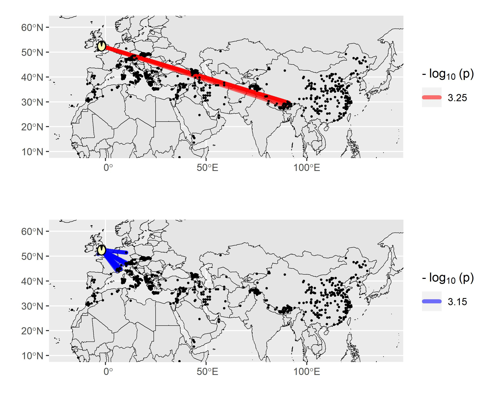

# Summary

Landscape genomics is an emerging field of research that integrates genomic and environmental information to explore the drivers of evolution.
Reliable data on the geographical origin of biological samples is a prerequisite for accurate landscape genomics studies.
Traditionally, researchers discover potentially questionable samples using visualization-based tools.
However, such approaches cannot handle large sample sizes due to overlapping data points on a graph and can hinder reproducible research.
To address this shortcoming, we developed **G**eo-**G**enetic **outlier** (`GGoutlieR`), an R package of a heuristic framework for detecting and visualizing samples with unusual geo-genetic patterns.
Outliers are detected through either geography-based K nearest neighbors (KNNs) or genetics-based KNNs.
The framework calculates empirical p-values for each sample, allowing users to easily identify outliers in data sets with thousands of samples.
The package also provides a plotting function to display the geo-genetic patterns of outliers on a geographical map.
GGoutlieR could significantly reduce the amount of data cleaning that researchers need to do before carrying out landscape genomics analyses.

# Statement of need

Landscape genomics is a thriving field in ecological conservation and evolutionary genetics [@aguirre2021evolutionary; @lasky2023genotype], providing insights into the links between genetic variation and environmental factors.
This methodology requires reliable geographical and genomic information on biological samples.
To determine whether data are reliable, researchers can examine associations between genetic similarities and the geographic origin of biological samples before proceeding with further studies.
Under the assumption of isolation-by-distance, pairwise genetic similarities of samples are expected to decrease with increasing geographical distance between the sample origins.
This assumption may be violated by long-distance migration or artificial factors such as human activity or data/sample management errors.

Visualization-based tools such as `SPA` [@yang2012model], `SpaceMix` [@bradburd2016spatial], `unPC` [@house2018evaluating] allow to identify samples with geo-genetic patterns that violate the isolation-by-distance assumption, but these tools do not provide statistics to robustly label outliers.
Advances in genome sequencing technologies lead to much larger sample sizes, such as in geo-genetic analyses of genebank collections of rice [@gutaker2020genomic; @wang2018genomic], barley [@milner2019genebank], wheat [@schulthess2022genomics], soybean [@liu2020pan] and maize [@li2019identifying].
Visualization-based approaches may not be suitable to display unusual geo-genetic patterns in big datasets due to the large number of overlapping data points on a graph.
To overcome this problem, we developed a heuristic statistical framework for detecting **G**eo-**G**enetic **outliers**, named `GGoutlieR`.
Our `GGoutlieR` package computes empirical p-values for violation of the isolation-by-distance assumption for individual samples according to prior information on their geographic origin and genotyping data.
This feature allows researchers to easily select outliers from thousands of samples for further investigation.
In addition, `GGoutlieR` visualizes the geo-genetic patterns of outliers as a network on a geographical map, providing insights into the relationships between geography and genetic clusters.

# Algorithm of `GGoutlieR`

Under the isolation-by-distance assumption, the geographical origins of samples are predictable from their patterns of genetic variation [@battey2020predicting;@guillot2016accurate], and vice versa.
In this context, prediction models should result in large prediction errors for samples that violate the isolation-by-distance assumption.
Based on this concept, we developed the GGoutlieR framework to model anomalous geo-genetic patterns.

Briefly, `GGoutlierR` uses *K*-nearest neighbour (KNN) regression to predict genetic components with the *K* nearest geographical neighbours, and also predicts in the opposite direction.
Next, the prediction errors are transformed into distance-based (*D*) statistics and the optimal *K* is identified by minimising the sum of the *D* statistics.
The *D* statistic is assumed to follow a gamma distribution with unknown parameters.
An empirical gamma distribution is obtained as the null distribution by finding optimal parameters using maximum likelihood estimation.
With the null gamma distribution, `GGoutlieR` tests the null hypothesis that the geogenetic pattern of a given sample is consistent with the isolation-by-distance assumption.
Finally, p-values are calculated for each sample using the empirical null distribution and prediction error statistics.
The details of the `GGoutlieR` framework are described step by step in the supplementary material (https://github.com/kjschmidlab/GGoutlieR/blob/master/paper/suppinfo.pdf).


# Example

### Outlier identification

For demonstration, we used the genotypic and passport data of the global barley landrace collection of 1,661 accessions from the IPK genebank [@milner2019genebank; @konig2020bridge].
The full analysis of the barley dataset with `GGoutlieR` is available in the vignette (https://github.com/kjschmidlab/GGoutlieR/blob/master/vignettes/outlier_detection.pdf).
Outliers were identified using the `ggoutlier` function.
The function `summary_ggoutlier` was then used to obtain a summary table of outliers by taking the output of `ggoutlier`.

```R
library(GGoutlieR)
data("ipk_anc_coef") # get ancestry coefficients
data("ipk_geo_coord") # get geographical coordinates

pthres = 0.025 # set a p-value threshold

## run GGoutlieR
ggoutlier_result <- ggoutlier(geo_coord = ipk_geo_coord,
                              gen_coord = ipk_anc_coef,
                              plot_dir = "./fig", 
                              p_thres = pthres, 
                              cpu = 4, 
                              klim = c(3,50), 
                              method = "composite",
                              verbose = F,
                              min_nn_dist = 1000)

## print out outliers
head(summary_ggoutlier(ggoutlier_result))

#>                 ID     method      p.value
#> 1  BRIDGE_HOR_2827     geoKNN 0.0002534661
#> 2 BRIDGE_HOR_12795     geoKNN 0.0002875591
#> 3    BRIDGE_BCC_37     geoKNN 0.0003014085
#> 4 BRIDGE_HOR_10557     geoKNN 0.0003502037
#> 5 BRIDGE_HOR_10555     geoKNN 0.0003697646
#> 6        BTR_FT519 geneticKNN 0.0003828147
```

### Visualization of unusual geo-genetic patterns


The unusual geo-genetic patterns detected by `GGoutlieR` can be presented on a geographical map with the function `plot_ggoutlier` (\autoref{fig:example}).

Moreover, the function `plot_ggoutlier` allows users to gain insight into outliers from a selected geographical region (\autoref{fig:example_UK}).



```R
## Visualize GGoutlieR results
## Figure 1: visualize all outliers
plot_ggoutlier(ggoutlier_res = ggoutlier_result,
               gen_coord = ipk_anc_coef,
               geo_coord = ipk_geo_coord,
               p_thres = pthres,
               map_type = "both",
               select_xlim = c(-20,140), 
               select_ylim = c(10,62),
               plot_xlim = c(-20,140),
               plot_ylim = c(10,62),
               pie_r_scale = 2,
               map_resolution = "medium")
               
## Figure 2: highlight outliers in UK with `select_xlim` and `select_ylim`
plot_ggoutlier(ggoutlier_res = ggoutlier_result,
               gen_coord = ipk_anc_coef,
               geo_coord = ipk_geo_coord,
               p_thres = pthres,
               map_type = "both",
               select_xlim = c(-12,4), 
               select_ylim = c(47,61),
               plot_xlim = c(-20,140),
               plot_ylim = c(10,62),
               pie_r_scale = 2,
               map_resolution = "medium",
               add_benchmark_graph = F,
               plot_labels = NA)
```

# Availability

The `GGoutlierR` package and vignette are available in our GitHub repository (https://github.com/kjschmidlab/GGoutlieR).


# Acknowledgement

We appreciate Dr. Martin Mascher and Max Haupt of Leibniz Institute of Plant Genetics and Crop Plant Research (IPK) for providing the raw VCF data of barley landraces that was used in the example.
The project at Schmid lab was supported by the funds from the Federal Ministry of Food and Agriculture (BMEL) according to a decision of the parliament of the Federal Republic of Germany via the Federal Office for Agriculture and Food (BLE) under the Federal Programme for Ecological Farming and Other Forms of Sustainable Agriculture (Project number 2818202615). 
C.W.C was supported by the Study Abroad Fellowship from the Education Ministry of Taiwan (R.O.C.) (Project number 1100123625).


# References
