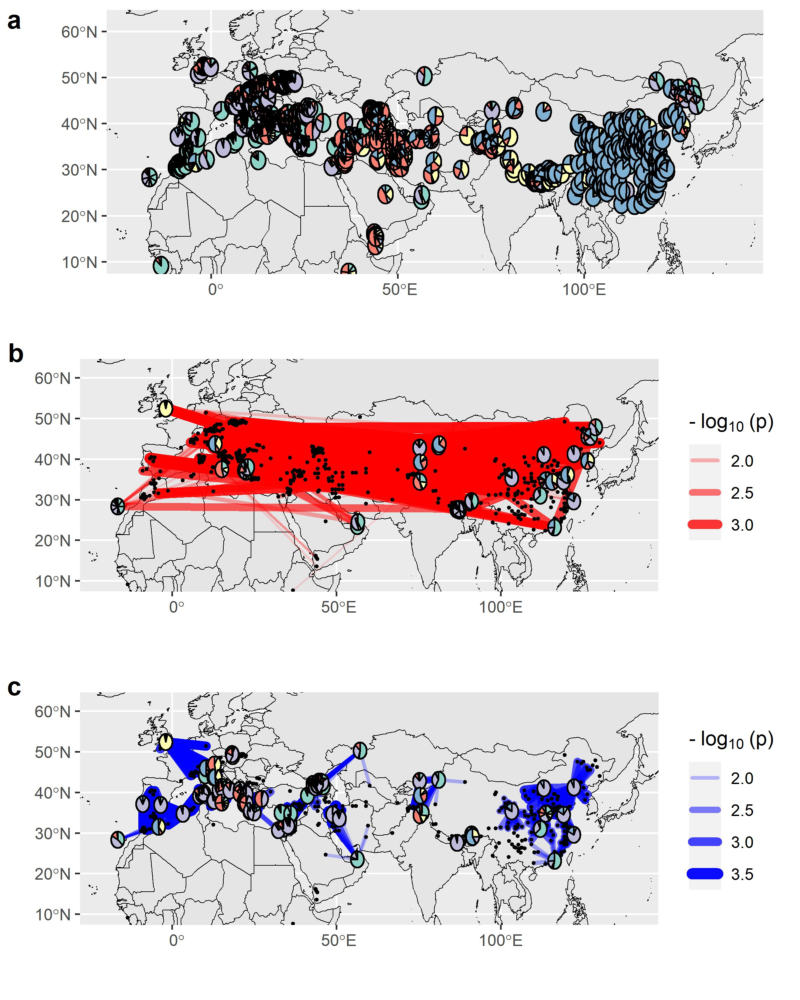

```{r, include=FALSE}
knitr::opts_chunk$set(
  comment = "#>", tidy='styler', tidy.opts=list(strict=FALSE)
)
```

<!---
The dataset used in this walk through were obtained and pre-processed.
For details, see: http://server228vsl.ipsp.uni-hohenheim.de/CheWeiChang/ggnet/-/blob/master/analysis/data.Rmd

Files for demo were copied from `ggnet` repos and renamed to make them be easier to understand
`gbs_georef_1661inds_beagle_imputed_maf0.01_SNPonly_rmChrUn_LDprune0.1.vcf.gz` 
      -> `IPKbarley_GBS1661landraces_LDpruned.vcf.gz`
`georef_1661ind_geo_coord_for_locator.txt`
      -> `IPK_1661ind_geo_coord.txt`
`alstructure_Q_hat_1661inds.csv`
      -> `IPK_1661inds_alstructure_Q_hat.csv`
      
TO DO:
 - modify the plotting functions to take single input from ggoutlier -> switch plotting modes according to attributes
 - add progress bar to internal functions of ggoutlier
 - [done] make a function to summarize ggoutlier output
 - [done] suppress library messages
 - [done] make w_power separate?
 - [done] add scalar and w to output
 - add git links before publishing the package
--->

## Introduction

This file is a short tutorial of the R package `GGoutlieR`.
`GGoutlieR` is developed to identify biological samples with anomalous geo-genetic associations that violate the assumption of isolation-by-distance.
Conventional visualization-based approaches have been used to investigate samples with unusual geo-genetic patterns.
However, they may not suitable for investigating large samples due to overlaps of data points on a graph.
Unlike conventional visualization-based approaches, **`GGoutlieR` is more feasible to explore a large data set because it provides heuristic statistics** that allow users to sort out samples tending to be outliers.
Moreover, `GGoutlieR` also has a plotting function to visualize the unusual geo-genetic associations on a real-world map.

In this vignette, we used a collection of global barley landraces as an example for investigating unusual geo-genetic patterns of a large sample with > 1,000 individuals.

## R functions

As we hope `GGoutlieR` to be a user-friendly tool, we wrapped the whole `GGoutlieR` statistical framework in a single R function `ggoutlier`.
Moreover, the results can be summarized and visualized with built-in functions of `GGoutlieR`.

The `GGoutlieR` package has three main functions:

* `ggoutlier`  
* `summary_ggoutlier`  
* `plot_ggoutlier`  

The function `ggoutlier` is used to carry out the `GGoutlieR` statistical framework. 
It will produce a `list` object recording all details, including statistics, p-values, the IDs of nearest neighbors of every sample, etc.

By giving the outputs from `ggoutlier`, `summary_ggoutlier` will produce a `data.frame` table showing the IDs and p-values of outliers.

For visualization, `plot_ggoutlier` takes the outputs from `ggoutleir` to overlay colored lines connecting outliers to their K nearest neighbors.
The depth of color and the width of lines is proportional to the -log(p) values.

## Barley landrace data

In this tutorial, we use the data of IPK barley landraces from the study of [Milner et al. 2019](https://www.nature.com/articles/s41588-018-0266-x).

The SNPs of barley landraces were obtained by aligning GBS sequences against the `Morex v3` genome.
The raw genotypic data of cultivated barley were then filtered with the criteria of `mac > 10` and `mis < 0.95` and subsequently imputed by `BEAGLE v5.2`.

After imputation, a total of 1661 georeferenced landraces were selected from the whole IPK collection according to the passport data procured from the [IPK BRIDGE database](https://bridge.ipk-gatersleben.de/).
Next, we pruned redundant SNPs based on linkage disequilibrium with `PLINK`.

* 1,661 geo-referenced landraces (no duplicates)
      * 29,219 SNPs; LD pruned with SNP $r^2$ < 0.1; MAF > 0.01; no missing   
      
The `vcf.gz` file is available at: https://gitlab.com/kjschmid/ggoutlier/-/blob/master/data/IPKbarley_GBS1661landraces_LDpruned.vcf.gz

## Pretreatment: calculate ancestry coefficients

`GGoutlieR` predicts genetic components from geographical coordinates with KNN regression to assess how likely a sample is an outlier.
The ancestry coefficients can be seen as dimension-reduced genotypic data describing genetic components and presenting genetic similarities.
Therefore, we took ancestry coefficients to quantify the genetic components of individuals.

We computed ancestry coefficients for 1,661 geo-referenced landraces using `ALStructure` ([Cabreros and Storey 2019](https://doi.org/10.1534/genetics.119.302159)).

Users can also infer ancestry coefficients with other software, such as `STRUCTURE` ([Pritchard et al. 2000](https://doi.org/10.1093/genetics/155.2.945)), `ADMIXTURE` ([Alexander et al. 2009](https://genome.cshlp.org/content/19/9/1655.short)), and `sNMF` ([Frichot et al. 2014](https://doi.org/10.1534/genetics.113.160572)).
The key point of this step is to prepare your data matrix of ancestry coefficients with individuals in rows and ancestral populations in columns.

### Get a numeric genotypic matrix

The R codes below first read `vcf.gz` with the `vcfR` package and converted `vcf` to a matrix of allele counts.
If you already have a matrix of allele counts coded with `0`, `1` and `2`, you can go to the [next section](#estimate-ancestry-coefficients).

```{r get_numeric_genotypic_matrix, eval=FALSE, echo=TRUE}
library(vcfR)
# a function to convert VCF to a numberic matrix
vcf_to_nummatrix <- function(vcf){
  require(vcfR)
  out <-
    apply(extract.gt(vcf), 2, function(x){
      c(0,0,1,1,1,2,2)[match(x, c("0/0", "0|0", "0/1", "0|1","1|0", "1/1", "1|1"))]
    })
  return(out)
} # vcf_to_nummatrix end

## read vcf
vcf <- read.vcfR("../data/IPKbarley_GBS1661landraces_LDpruned.vcf.gz")
Xmat <- vcf_to_nummatrix(vcf = vcf) # convert VCF to a numeric matrix
any(is.na(Xmat)) # FALSE
colnames(Xmat) <- gsub(colnames(Xmat), pattern = "^0_", replacement = "") # remove prefix
```

### Estimate ancestry coefficients

After converting `vcf` format to a matrix of allele counts, we used `estimate_d` to identify the optimal number of ancestral populations (`dhat`), and then inferred ancestry coefficients accordingly.

The ancestry coefficients of IPK barley landraces are available in the `GGoutlieR` package, so you don't have to run the code block below.
To go through this demo, you can get the ancestry coefficients by typing 

* `data("ipk_anc_coef")`

Also, we need geographical data of our IPK barley landraces.
You can get the data with

* `data("ipk_geo_coord")`

<!---
The ancestry coefficients were saved as `IPK_1661inds_alstructure_Q_hat.csv`, which can be found in our repository (`http://server228vsl.ipsp.uni-hohenheim.de/CheWeiChang/ggoutlier/-/tree/master/data/`).
--->

```{r compute_Q, eval=FALSE}
# estimate ancestry coefficients for 1661 individuals
library(alstructure) # load ALSTRUCTURE

# search for the optimal number of ancestral populations
dhat <- estimate_d(Xmat) # optimal d is 5

# get ancestry coefficients
fit.als <- alstructure(Xmat, d = dhat)
alsQ <- fit.als$Q_hat
colnames(alsQ) <- colnames(Xmat)

## write csv 
write.table(alsQ, "../data/IPK_1661inds_alstructure_Q_hat.csv",
            row.names = F, col.names = T, sep = ",")
```

```{r put_barley_data_in_package, eval=FALSE, echo=FALSE}
ipk_geo_coord <- read.table("../data/IPK_1661ind_geo_coord.txt", header = T, stringsAsFactors = F)
rownames(ipk_geo_coord) <- ipk_geo_coord[,1]
ipk_geo_coord <- ipk_geo_coord[,-1]
ipk_anc_coef <- t(as.matrix(read.csv("../data/IPK_1661inds_alstructure_Q_hat.csv", header = F, stringsAsFactors = F)))

usethis::use_data(ipk_geo_coord)
usethis::use_data(ipk_anc_coef)
```

## Identify outliers with unusual geo-genetic patterns

Here we used `GGoutlieR` to identify individuals with unusual geo-genetic associations.
To run `GGoutlieR`, users need two data:

* a matrix of geographical coordinates (the first and second columns are longitude and latitude)
* a matrix of ancestry coefficients

### Get example data

As mentioned in the previous section, the IPK barley landrace data are available in the `GGoutlieR` package.
We can load the data set with `data()` as below.

```{r get_ipk_data, eval=TRUE}
library(GGoutlieR)
data("ipk_anc_coef") # get ancestry coefficients
data("ipk_geo_coord") # get geographical coordinates

# check data
head(ipk_anc_coef)
head(ipk_geo_coord)
```

### Run `GGoutlieR` analysis

`ggoutlier` is the main function for carrying out the `GGoutlieR` framework analysis.
(Please find the details of `GGoutlieR` framework in the supplementary material: https://gitlab.com/kjschmid/ggoutlier/-/blob/master/paper/suppinfo.pdf)

In short, `GGoutlieR` framework includes following major steps:

* search for an optimal number (K) of nearest neighbors (`ggoutlier` searches the optimal K by default. Users can specify the number of nearest neighbors with the argument `K`.)   
* search K nearest neighbors (KNNs) with the optimal K or the given K.  
* compute distance-based `D` statistics
* obtain a heuristic null distribution of `D` with maximum likelihood estimation.
* carry out statistical tests:  
      - compute p-values for every sample according to `D` if `multi_stages = TRUE`.   
      - iteratively search KNNs, conduct statistical tests and remove the most significant samples until no new significant sample raises if `multi_stages = FALSE` (default).  

Three different methods are available by setting the argument `method`:

* `method = "composite"`
* `method = "geneticKNN"`
* `method = "geoKNN"`

With `method = "composite"`, `ggoutlier` performs both `geneticKNN` and `geoKNN` methods, and it sequentially removes the most significant sample among `geneticKNN` and `geoKNN` methods in the multi-stage tests.
We would use the results from the `composite` method for further demonstration.

The argument `make_fig = TRUE` (the default is `FALSE`) is used to generate figures for diagnosis of KNN search and the heuristic null distribution in the directory of `plot_dir`.

The argument `verbose = FALSE` is used to suppress the printout message.
If you want to see the running progress of `ggoutlier`, set `verbose = TRUE`.

```{r run_ggoutlier, eval=FALSE, echo = TRUE}
pthres = 0.025 # set a threshold

## run GGoutlieR with the composite approach (this example takes about 12 minutes)
compositeknn_res <- ggoutlier(geo_coord = ipk_geo_coord,
                              gen_coord = ipk_anc_coef,
                              make_fig = TRUE,
                              plot_dir = "../fig", 
                              p_thres = pthres, 
                              cpu = 4, 
                              klim = c(3,50), 
                              method = "composite",
                              verbose = F,
                              min_nn_dist = 1000)


```

```{r run_ggoutlier_not_show, echo=FALSE, eval=FALSE}
## test computational time
system.time(
  compositeknn_res <- ggoutlier(geo_coord = ipk_geo_coord,
                              gen_coord = ipk_anc_coef,
                              make_fig = FALSE,
                              plot_dir = "../fig", 
                              p_thres = 0.005, 
                              cpu = 4, 
                              klim = c(3,30), 
                              method = "composite",
                              verbose = F,
                              min_nn_dist = 1000,
                              multi_stages = F)) # 54 sec
system.time(
  compositeknn_res <- ggoutlier(geo_coord = ipk_geo_coord,
                              gen_coord = ipk_anc_coef,
                              make_fig = FALSE,
                              plot_dir = "../fig", 
                              p_thres = 0.025, 
                              cpu = 4, 
                              klim = c(3,50), 
                              method = "composite",
                              verbose = F,
                              min_nn_dist = 1000,
                              multi_stages = T))# 728 sec
## run GGoutlieR with the approach of genetic space KNN only
geneticknn_res <- ggoutlier(geo_coord = ipk_geo_coord,
                            gen_coord = ipk_anc_coef,
                            make_fig = TRUE,
                            plot_dir = "../fig", 
                            p_thres = pthres, 
                            cpu = 4, 
                            klim = c(3,50), 
                            method = "geneticKNN",
                            verbose = F)

## run GGoutlieR with the approach of geographical space KNN only
geoknn_res <- ggoutlier(geo_coord = ipk_geo_coord,
                        gen_coord = ipk_anc_coef,
                        make_fig = TRUE,
                        plot_dir = "../fig", 
                        p_thres = pthres, 
                        cpu = 4,
                        min_nn_dist = 1000, 
                        klim = c(3,50), 
                        method = "geoKNN",
                        verbose = F)
```


```{r write_and_read_ggoutlier_output, eval=TRUE, echo=FALSE}
#saveRDS(geneticknn_res, file = "../data/IPK_landrace_ggoutlier_geneticKNN_output_p0.05.RDS")
#saveRDS(geoknn_res, file = "../data/IPK_landrace_ggoutlier_geoKNN_output_p0.05.RDS")
#saveRDS(compositeknn_res, file = "../data/IPK_landrace_ggoutlier_composite_output_p0.05.RDS")
#saveRDS(geneticknn_res, file = "../data/IPK_landrace_ggoutlier_geneticKNN_output_p0.01.RDS")
#saveRDS(geoknn_res, file = "../data/IPK_landrace_ggoutlier_geoKNN_output_p0.01.RDS")
#saveRDS(compositeknn_res, file = "../data/IPK_landrace_ggoutlier_composite_output_p0.01.RDS")
#saveRDS(geneticknn_res, file = "../data/IPK_landrace_ggoutlier_geneticKNN_output_p0.025.RDS")
#saveRDS(geoknn_res, file = "../data/IPK_landrace_ggoutlier_geoKNN_output_p0.025.RDS")
#saveRDS(compositeknn_res, file = "../data/IPK_landrace_ggoutlier_composite_output_p0.025.RDS")

#geneticknn_res <- readRDS("../data/IPK_landrace_ggoutlier_geneticKNN_output_p0.025.RDS")
#geoknn_res <- readRDS("../data/IPK_landrace_ggoutlier_geoKNN_output_p0.025.RDS")
compositeknn_res <- readRDS("../supp_data/IPK_landrace_ggoutlier_composite_output_p0.025.RDS") # load ggoutlier results saved in advance
```


```{r make_packageData_for_runningExample, echo = FALSE, eval=FALSE}
library(GGoutlieR)
data("ipk_anc_coef") # get ancestry coefficients
data("ipk_geo_coord") # get geographical coordinates
ggoutlier_example <- ggoutlier(geo_coord = ipk_geo_coord,
                               gen_coord = ipk_anc_coef,
                               make_fig = TRUE,
                               plot_dir = "./fig",
                               p_thres = 0.01,
                               cpu = 2,
                               method = "composite",
                               verbose = FALSE,
                               min_nn_dist = 1000)
ggoutlier_example <- compositeknn_res
usethis::use_data(ggoutlier_example)

data("ggoutlier_example")
compositeknn_res <- ggoutlier_example
```


After running `ggoutlier`, we use `summary_ggoutlier` to extract the IDs and p-values of outliers. 
Users can select outliers according to the summary table from `summary_ggoutlier` for further investigation.

```{r show_result_table, eval=TRUE}
## check the head of summary table
head(summary_ggoutlier(compositeknn_res))
length(unique(summary_ggoutlier(compositeknn_res)$ID))
```

To visualize outliers on a geographical map, `plot_ggoutlier` draws colored lines connecting outliers to corresponding nearest neighbors on a geographical map.
The color depth and thickness of lines are proportional to the -log(p) values.

As described in the supplementary material (https://gitlab.com/kjschmid/ggoutlier/-/blob/master/paper/suppinfo.pdf), `GGoutlieR` framework identifies outliers based on two types of KNN approaches:

* **geographical KNN**: K nearest neighbors defined based on geographical distances, used to predict genetic components.  
* **genetic KNN**: K nearest neighbors defined based on genetic distances, used to predict geographical locations.

In the graph made by `plot_ggoutlier`, the geographical KNNs of outliers are displayed with blue lines, whereas red lines present genetic KNNs.
In other words, blue lines and red lines indicate:

* Blue lines: sample pairs with unusually **high genetic difference** within a **short geographical distance**  
* Red lines: sample pairs with unusually **high genetic similarity** across a **long geographical distance**

Users can decide which type of KNNs to draw with `map_type = "geographic_knn"`, `map_type = "genetic_knn"` or `map_type = "both"`.

Additionally, the `plot_ggoutlier` function projects ancestry coefficients of outliers to a geographical map as pie charts (the default with `show_knn_pie = TRUE`).
Users can therefore present population genetic structure integrating geo-genetic patterns unveiled by `GGoutlieR`.

The code block below produced two figures (**Fig. 1**)
The figure on the top is a geographical map with ancestry coefficients as pie charts.
The figure at the bottom presents the results of `GGoutlieR`.
The example here overlaid both red and blue lines on the same map (with the argument `map_type = "both"`).
Users can keep only blue or red lines by setting `map_type = "geographic_knn"` or `map_type = "genetic_knn"`, respectively.

```{r ggoutlier_graph, eval=FALSE}
plot_ggoutlier(ggoutlier_res = compositeknn_res,
               gen_coord = ipk_anc_coef,
               geo_coord = ipk_geo_coord,
               p_thres = pthres,
               map_type = "both",
               select_xlim = c(-20,140), 
               select_ylim = c(10,62),
               plot_xlim = c(-20,140),
               plot_ylim = c(10,62),
               pie_r_scale = 1.2,
               map_resolution = "medium",
               adjust_p_value_projection = F)
```

{width=100%}
*Figure 1. Ancestry coefficients and geo-genetic patterns of outliers identified by GGoutlieR*

`plot_ggoutlier` can crop the network graph by setting `select_xlim` and `select_ylim` (`plot_xlim` and `plot_xlim` are used to control the boundaries of a geographical map)
The codes below retain the links between outliers located in the UK and corresponding KNNs (**Fig. 2**).
We can find that the outliers in the UK are genetically close to the samples from Southern Tibet.
This pattern would be difficult to identify with conventional visualization tools, such as PCA of DNA markers or projection of ancestry coefficients on a geographical map, due to overlaps of data points on a graph.
Also, our visualization tool provides more insights into unusual geo-genetic associations on an individual basis.

```{r ggoutlier_graph_highlightUK, eval=FALSE}
plot_ggoutlier(ggoutlier_res = compositeknn_res,
               gen_coord = ipk_anc_coef,
               geo_coord = ipk_geo_coord,
               p_thres = pthres,
               map_type = "both",
               select_xlim = c(-12,4), 
               select_ylim = c(47,61),
               plot_xlim = c(-20,140),
               plot_ylim = c(10,62),
               pie_r_scale = 1.2,
               map_resolution = "course",
               adjust_p_value_projection = F,
               add_benchmark_graph = F)
```

{width=100%}
*Figure 2. GGoutlieR results with highlights of outliers in the UK*

```{r make_fig_for_paper_and_vignette,eval=FALSE,echo=FALSE}
jpeg(filename = "./fig/IPK_ggoutlier_for_paper.jpg", res = 400,
     height = 3000, width = 2400)
plot_ggoutlier(ggoutlier_res = compositeknn_res,
               gen_coord = ipk_anc_coef,
               geo_coord = ipk_geo_coord,
               p_thres = pthres,
               map_type = "both",
               select_xlim = c(-20,140), 
               select_ylim = c(10,62),
               plot_xlim = c(-20,140),
               plot_ylim = c(10,62),
               pie_r_scale = 1.5,
               map_resolution = "medium",
               adjust_p_value_projection = F)
dev.off()

jpeg(filename = "./fig/IPK_ggoutlier_highlighUK.jpg", res = 400,
     height = 2000, width = 2400)
plot_ggoutlier(ggoutlier_res = compositeknn_res,
               gen_coord = ipk_anc_coef,
               geo_coord = ipk_geo_coord,
               p_thres = pthres,
               map_type = "both",
               select_xlim = c(-12,4), 
               select_ylim = c(47,61),
               plot_xlim = c(-20,140),
               plot_ylim = c(10,62),
               pie_r_scale = 2,
               map_resolution = "medium",
               adjust_p_value_projection = F,
               add_benchmark_graph = F,
               plot_labels = NA)
dev.off()
```

